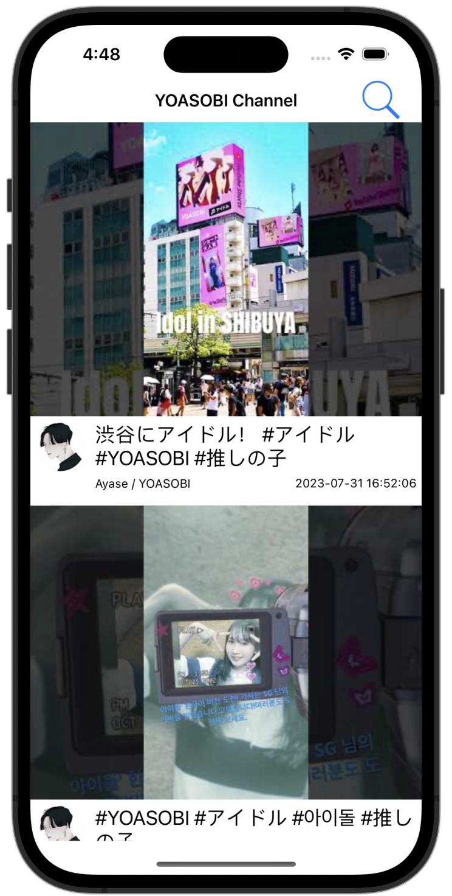
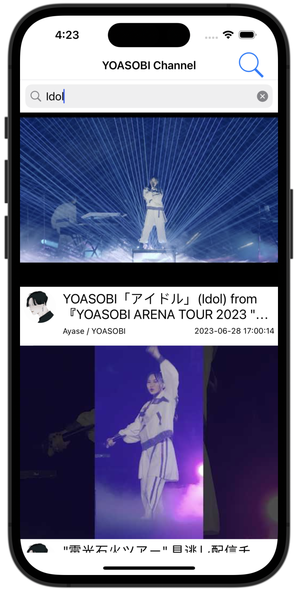
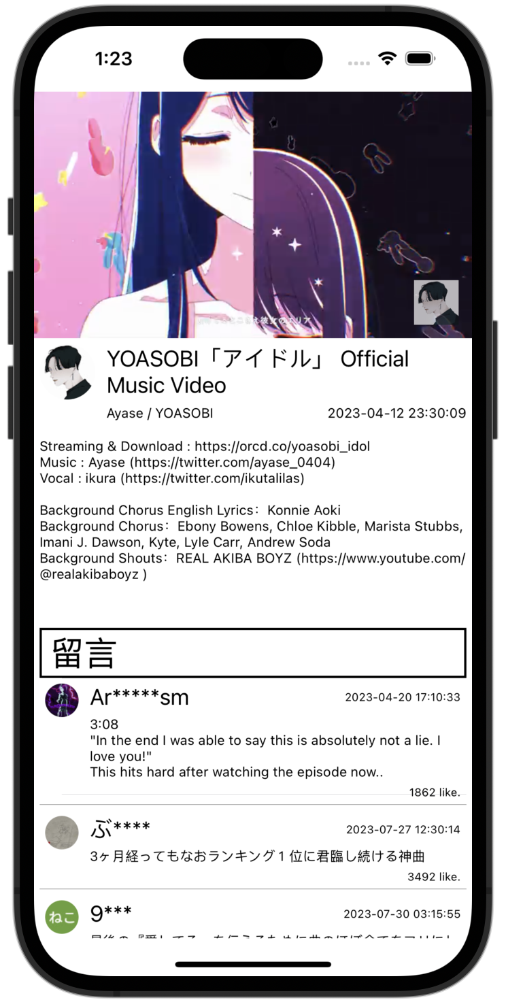
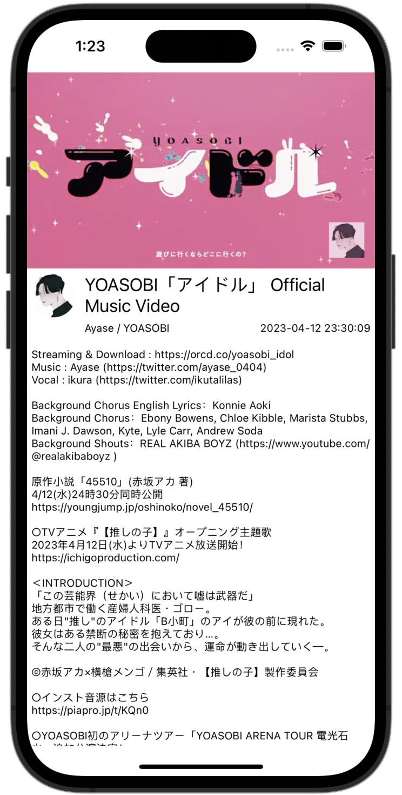
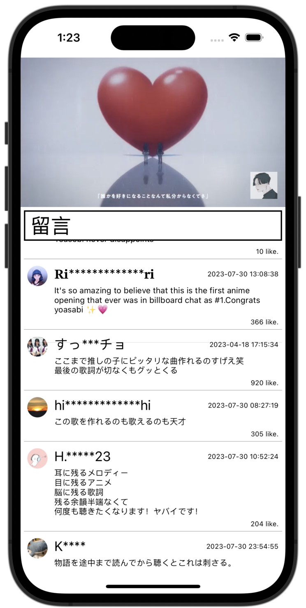

#  Skywatch pretest

## App使用說明

這是一個針對單一頻道的Youtube播放App，可以在這個App內查看指定頻道(我選用YOASOBI官方頻道)內所有的影片。

### 播放列表畫面
| 播放列表 | 搜尋影片 |
| --- | --- |
|  |  |

- 播放列表畫面會讀取頻道內的所有影片(包含Short)，由新到舊依序顯示在畫面上。
- 此列表會優先讀取本地端的資料做顯示，若資料過於老舊，可透過下拉刷新的方式，重新取得最新的列表。
- 依照題目要求，首次取得列表時可取得30個影片資訊，當列表滑動至底部時，會自動載入後續20個影片資訊。
- 右上角搜尋按鈕可開啟或隱藏搜尋框，於搜尋框內輸入文字，可對影片標題進行模糊搜尋。
- 於搜尋狀態中將App關閉，下次開啟App時可復原至上次搜尋的結果畫面。
- 參照Youtube App，於播放列表畫面無法將螢幕轉為橫屏顯示。
- 點擊影片縮圖可進入該影片的播放頁面。

### 影片播放器畫面
| 播放器畫面 | 顯示更多描述 | 顯示留言 |
| --- | --- | --- |
|  |  |  |

- 參照Youtube App的操作方法，於播放畫面上拖曳下滑可關閉此播放器畫面。
- 播放器使用Youtube提供的套件，因此操作手法與Youtube相同，支援連續點擊快進或快退，點擊畫面播放或暫停等手勢。
- 於播放器頁面無法橫屏播放，但點擊播放器全螢幕播放後可橫屏播放。
- 若影片下方描述顯示不完整，可點擊描述顯示更多資訊，再次點擊可復原為顯示少量描述。
- 滑動畫面至下方可顯示該影片的留言，留言與影片列表相同，單次載入30則，滑到底會自動載入後續的20則。
- 依照題目保護用戶資訊要求，將留言的用戶部分名稱使用「\*」顯示，若名稱太短則直接用「\*」取代
- 留言依照熱門度排序(Youtube演算法決定)，留言除了顯示頭像、名稱、內容外，也同步顯示按讚數與發佈日期。

## 設計概念與想法

此專案以MVVM架構設計(Combine)，使用Siwft與UIKit進行實作，Unit Test的部分使用XCTest撰寫。

### 對題目的理解
1. Unit Test的部分
    
    由於題目要求要有Unit Test，因此嘗試使用測試驅動開發(TDD)的方式實作，優先撰寫針對API資料的Unit Test，在撰寫ViewModel的Unit Test，最後才做畫面的Layout，此做法的好處是可以優先知道後端的資料是否符合需求，若是與後端協作可快速與後端溝通，且在實作畫面時，可確保所需要的資料沒有缺漏。

1. 本地端暫存

    可節省API的呼叫次數，與儲存畫面當前的狀態，因此本地端暫存基本實作在View Model上，可儲存使用者上次使用的狀況，下次開啟App時，可將App復原至最後關閉App的畫面。

## 可優化方向

1. 播放列表新增播放次數排序
1. 播放列表將影片與短影片(Short)分開顯示
1. 