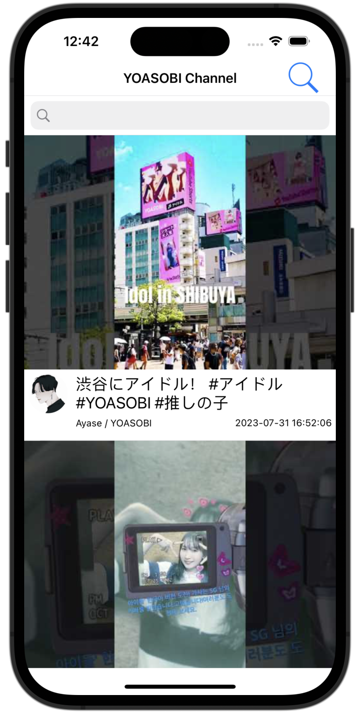

#  Skywatch pretest

## App使用說明

這是一個針對單一頻道的Youtube播放App，可以在這個App內查看指定頻道(我選用YOASOBI官方頻道)內所有的影片。

### 播放列表畫面

- 播放列表畫面會讀取頻道內的所有影片(包含Short)，由新到舊依序顯示在畫面上。
- 此列表會優先讀取本地端的資料做顯示，若資料過於老舊，可透過下拉刷新的方式，重新取得最新的列表。
- 依照題目要求，首次取得列表時可取得30個影片資訊，當列表滑動至底部時，會自動載入後續20個影片資訊。
- 右上角搜尋按鈕可開啟或隱藏搜尋框，於搜尋框內輸入文字，可對影片標題進行模糊搜尋，過濾出指定影片。
- 參照Youtube App，於播放列表畫面無法將螢幕轉為橫屏顯示。
- 點擊影片縮圖可進入該影片的播放頁面。

### 影片播放器畫面

    

        
    

    

        
    

    

        
    

## 設計概念與想法

## 可優化方向

1. 播放列表新增播放次數排序
1. 播放列表將影片與短影片(Short)分開顯示
1. 